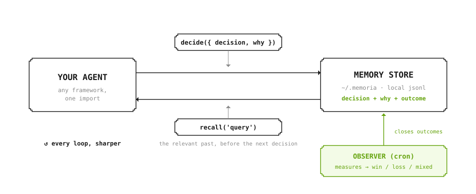
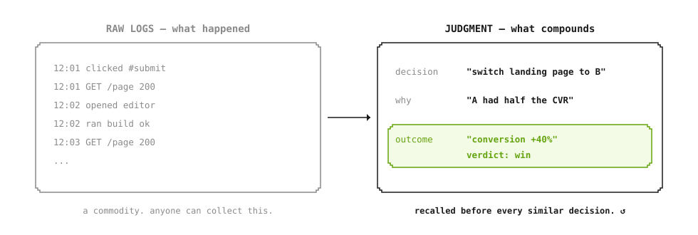

# memoria-connect

**A drop-in memory + judgment layer for AI agents.** Connect any agent in one
import and it starts getting sharper the more you run it.

<p align="center">
  
</p>

Most agent logs are raw data — *what* happened. That's a commodity; anyone can
collect it. What actually compounds is the **judgment**: the *decision*, the
*why*, and *how it turned out*. `memoria-connect` captures that triple, recalls
the relevant past before the next decision, and closes outcomes automatically.

<p align="center">
  
</p>

- **One-line connect** — `decide({ decision, why })`, that's it.
- **Recall before you decide** — pull the relevant past judgments back in.
- **Outcomes close themselves** — attach a spec; a background pass measures the
  result and closes the loop.
- **Local & private** — everything is written to *your* store
  (`$MEMORIA_HOME` or `~/.memoria`). No data ships with this package, and none
  leaves your machine.
- **Zero dependencies.** Node ≥ 18, ESM.

## Install

```bash
npm install memoria-connect
```

## Use it (library)

```js
import { decide, outcome, recall } from 'memoria-connect';

// Recall the relevant past before deciding.
const prior = recall('landing page conversion');

// Record the decision the moment you make it. `decision` and `why` are required.
const id = decide({
  agent: 'growth-agent',
  decision: 'switch landing page to variant B',
  why: 'variant A had half the conversion rate',
  context: 'homepage-experiment',
});

// Later, when you know how it went:
outcome(id, { result: 'conversion +40%', verdict: 'win' }); // win | loss | mixed
```

Records are free text an agent wrote, so you can always take one back out:

```js
import { forget, prune } from 'memoria-connect';

forget(id);                        // erase one judgment from both ledgers
prune({ olderThanDays: 365 });     // trim old records; open judgments are kept
```

## Close outcomes automatically

Attach an `outcomeSpec` and let the observer close it once the result is
measurable. "How to measure" differs per decision, so the decision declares the
spec and the observer resolves it through a pluggable probe registry.

```js
decide({
  agent: 'growth-agent',
  decision: 'switch landing page to variant B',
  why: 'variant A had half the conversion rate',
  context: 'homepage-experiment',
  outcomeSpec: {
    metric: 'kpi-file',       // read a KPI from a JSON file and compare to a baseline
    path: '/path/to/kpi.json',
    field: 'cvr',
    baseline: 0.02,
    betterIsUp: true,
    margin: 0.1,              // ≥10% better => win, ≥10% worse => loss, else mixed
    afterHours: 72,           // don't measure until the result has had time to land
  },
});
```

Run a pass (schedule it with cron / launchd for full automation):

```bash
memoria observe
```

Built-in probes:

| metric          | closes on                                                        |
| --------------- | ---------------------------------------------------------------- |
| `kpi-file`      | a numeric KPI in a JSON file vs. a baseline (win/loss/mixed)      |
| `memory-signal` | negative/positive keywords appearing in later memory for the context |
| `manual`        | never — you close it yourself                                     |

Add your own:

```js
import { observe, PROBES } from 'memoria-connect/observe';
PROBES['my-metric'] = (row) => ({ result: '...', verdict: 'win' }); // or null to wait
observe();
```

## CLI

```bash
memoria decide  --agent A --decision "..." --why "..." [--context C] [--tags a,b]
memoria outcome <id> --result "..." --verdict win|loss|mixed
memoria open
memoria recall  "query text" [--limit 5]
memoria observe [--dry]
memoria forget  <id>     # erase one judgment from the store
memoria prune   [--days 365] [--include-open]
memoria where            # print where your store lives
```

Use `--flag=value` for a value that itself starts with `--`, or put positional
arguments after a bare `--`.

## Schedule the observer

macOS (launchd) or Linux (cron), e.g. every 30 minutes:

```cron
*/30 * * * * memoria observe >> ~/.memoria/observe.log 2>&1
```

## Real-world use

How this runs in my own company (e-commerce stores operated by AI agents),
today:

- **Customer-support agent** — every reply/refund decision is recorded with its
  why; a human approval or the refund result closes the outcome. Recall means
  the same mistake is never repeated across stores.
- **Agent fleets** — parallel build/research agents each record
  decision + why as they work; wins are distilled into reusable playbooks, so
  the next fleet starts from the last fleet's judgment instead of from zero.
- **My own judgment** — a local screen watcher turns my workday into memory,
  and the observer closes my calls (ship / postpone / pick approach X) against
  what actually happened — so my agents recall *my* judgment, not just their
  own.

## Screen memory (macOS)

The judgment layer answers "what did we decide and how did it go" — the
[screen module](screen/) answers **"what is the user doing right now"**. A menu
bar watcher samples your displays every ~2s into one self-updating memo
(frontmost window, its on-screen text via AX/OCR, browser URL, timestamped
timeline), ready to inject into any agent's prompt. Local-only, with a
👁🟢/👁⚠️ health icon so silent failures are impossible. See
[`screen/README.md`](screen/README.md).

## How it fits together

```
 any agent ──[decide]──▶ memory.jsonl ──[recall]──▶ next decision
                 │                                      ▲
                 ▼ open ledger                          │
           [observe] ──measures the result──▶ [outcome] ┘
   decision + why  ──(auto)──▶  decision + why + outcome  ↺  (compounds)
```

## Data & privacy

`memoria-connect` stores everything locally under `$MEMORIA_HOME` (default
`~/.memoria`) as plain JSONL. Nothing is uploaded. The package ships no data.

The store holds the *reasons* behind your agent's decisions, which is usually
the sensitive part, so it is created private to its owner — `0700` on the
directory, `0600` on the files. It is **not encrypted**: treat it like a
notebook, and don't write credentials into `decision` / `why`. Use `forget(id)`
to erase a record and `prune()` to enforce a retention window.

## Concurrency

Writes take a lock (a `.lock` directory inside the store), so your app and a
cron'd `memoria observe` can write at the same time without losing each other's
updates. A writer that dies while holding the lock is cleared automatically
after 30s; waiting writers give up after 5s with a clear error.

## License

[PolyForm Noncommercial 1.0.0](LICENSE) — free to use, modify, and share for
any noncommercial purpose. Commercial use requires permission from the author.
Keep the copyright notice; this project is by [kota1020](https://github.com/kota1020).

Versions published before this change were MIT-licensed and remain so.
